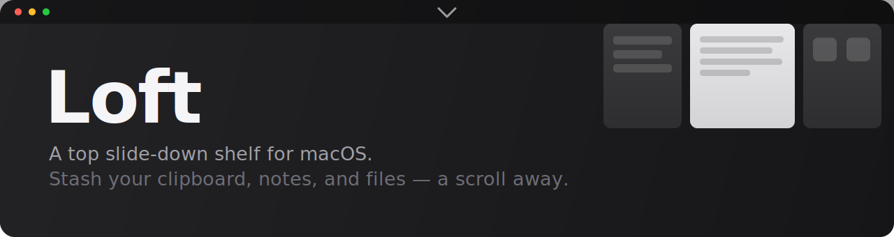

<div align="center">



# Loft

**A top slide-down shelf for macOS — stash your clipboard, notes, and files, a scroll away.**

[](https://github.com/HuriHuchi/loft/actions/workflows/release-please.yml)
[](https://github.com/HuriHuchi/loft/releases/latest)
[](LICENSE)


</div>

---

Loft lives in your menu bar with no Dock icon. Flick your cursor to the top of the
screen and **scroll down** — a shelf slides out of the menu bar with three panes:
your **clipboard history**, a **scratch note**, and a **drag-and-drop file tray**.
Scroll back up (or hit `Esc`) and it tucks away. It never steals focus, so it
overlays whatever you're working in.

<div align="center"></div>

## ✨ Features

- **📋 Clipboard history** — every copy (text **and** images) is captured
  automatically, newest first. Click an entry to view it in full and re-copy it to
  the system clipboard in one motion. Hover to remove, or **Clear** the lot.
- **📝 Scratch notes** — a persistent textarea that's always one scroll away.
  Debounced autosave; survives reveal, hide, and restart.
- **🗂️ File tray** — drag files onto the shelf to park them. Each shows its real
  macOS icon; double-click to open, hover to remove.
- **🖱️ Scroll-to-reveal** — a global gesture at the top edge of the screen. No
  hotkey to memorize, no window to manage.
- **🎛️ Resizable panes** — drag the dividers; your layout is remembered.
- **🪶 Menu-bar native** — no Dock icon, never steals focus, GPU-cheap slide.
- **🔄 Auto-update** — quiet background updates from GitHub Releases.

## 📦 Install

Grab the latest `.dmg` for your chip from the
[**Releases**](https://github.com/HuriHuchi/loft/releases/latest) page:

| Chip | File |
| --- | --- |
| Apple Silicon (M1–M4) | `Loft-<version>-arm64.dmg` |
| Intel | `Loft-<version>-x64.dmg` |

Open the `.dmg` and drag **Loft** to Applications.

> [!IMPORTANT]
> Loft is currently distributed **unsigned** (no paid Apple Developer certificate
> yet), so macOS Gatekeeper blocks it on first launch. Clear the quarantine flag
> once after installing:
> ```bash
> xattr -dr com.apple.quarantine /Applications/Loft.app
> ```

### Grant Accessibility permission

The scroll-to-reveal gesture uses a global input hook, which needs **Accessibility**
access. Loft prompts on first launch; if you miss it, enable it manually:

**System Settings → Privacy & Security → Accessibility → enable _Loft_.**

Loft detects the grant and starts working within a couple of seconds — no restart
needed. (Because the build is unsigned, macOS resets this permission on each
update; just toggle it back on.)

<details>
<summary>🇰🇷 한국어 설치 안내</summary>

1. [**Releases**](https://github.com/HuriHuchi/loft/releases/latest) 페이지에서 칩에 맞는 `.dmg`를 받으세요.

   | 칩 | 파일 |
   | --- | --- |
   | Apple Silicon (M1–M4) | `Loft-<버전>-arm64.dmg` |
   | Intel | `Loft-<버전>-x64.dmg` |

2. `.dmg`를 열고 **Loft**를 Applications로 드래그합니다.

3. 아직 코드 서명 전이라 macOS Gatekeeper가 첫 실행을 막습니다. 설치 후 **한 번만** 아래 명령으로 격리(quarantine) 플래그를 제거하세요.

   ```bash
   xattr -dr com.apple.quarantine /Applications/Loft.app
   ```

   > macOS Sequoia(15)부터는 우클릭 → 열기 우회가 막혀서, 위 명령(또는 **시스템 설정 → 개인정보 보호 및 보안 → "확인 없이 열기"**)이 확실한 방법입니다.

### 손쉬운 사용 권한 허용

스크롤로 펼치는 제스처는 전역 입력 훅을 쓰기 때문에 **손쉬운 사용(Accessibility)** 접근이 필요합니다. 첫 실행 시 Loft가 요청하며, 놓쳤다면 수동으로 켜세요.

**시스템 설정 → 개인정보 보호 및 보안 → 손쉬운 사용 → _Loft_ 활성화**

권한을 켜면 몇 초 안에 Loft가 자동으로 인식해 동작합니다(재시작 불필요). 미서명 빌드라 **업데이트할 때마다 이 권한이 초기화**되니 다시 켜주면 됩니다. 또한 서명 전에는 **자동 업데이트가 되지 않으므로** 새 버전은 릴리즈 페이지에서 직접 받아야 합니다.

</details>

## 🛠️ Build from source

**Prerequisites:** [Node.js](https://nodejs.org) 22+ and [pnpm](https://pnpm.io) 10+.

```bash
git clone https://github.com/HuriHuchi/loft.git
cd loft
pnpm install        # also downloads Electron + rebuilds the native input hook

pnpm dev            # run in development (hot reload)
pnpm build:mac      # produce a distributable .dmg in dist/
```

Other scripts:

| Command | What it does |
| --- | --- |
| `pnpm dev` | Launch the app with hot reload |
| `pnpm typecheck` | Type-check main, preload, and renderer |
| `pnpm build` | Bundle main/preload/renderer to `out/` |
| `pnpm build:mac` | Bundle **and** package a `.dmg` |

## 🧭 How it works

```
┌── main (Node) ───────────────┐     ┌── renderer (React) ──────────┐
│ uiohook-napi global wheel hook│ IPC │ slide-down panel, 3 panes    │
│ → detects scroll at top edge  │◀───▶│ clipboard / notes / files    │
│ tray, clipboard watcher, IPC  │     │ GPU transform for the slide  │
└───────────────────────────────┘     └──────────────────────────────┘
```

- A frameless, transparent window is pinned to the top of the active display and
  shown **without stealing focus** (`showInactive`). Revealing/hiding is a pure CSS
  `translateY` transition on the content — the OS window bounds never animate, so
  the slide stays cheap.
- The reveal/dismiss gesture is decided in the main process from a global wheel
  hook ([`uiohook-napi`](https://github.com/SnosMe/uiohook-napi)); scroll-up inside
  a scrollable list navigates it and only dismisses on overscroll.
- Clipboard history and dropped files persist under the app's `userData`; notes
  live in the renderer's `localStorage`.

**Stack:** Electron 43 · [electron-vite](https://electron-vite.org) · React 19 ·
Tailwind CSS 4 · TypeScript.

## 🚀 Releasing

Releases are fully automated with
[release-please](https://github.com/googleapis/release-please) +
[Conventional Commits](https://www.conventionalcommits.org):

1. Land `feat:` / `fix:` commits on `main` (a commit-msg hook lints the format).
2. release-please opens a **release PR** that bumps the version and updates the
   changelog. Merge it.
3. CI tags the release, builds per-arch `.dmg`s, and publishes them with an
   `latest-mac.yml` auto-update feed.

## 📸 Capturing media

To refresh the demo GIF, screen-record the reveal gesture (e.g. with
[Kap](https://getkap.co)), then optimize it before committing so it stays
git-friendly (the current `docs/demo.gif` is ~4.4 MB, downscaled to 1200px at
15 fps with ffmpeg):

```bash
ffmpeg -i recording.gif -vf "fps=15,scale=1200:-1:flags=lanczos,palettegen=stats_mode=diff" -y palette.png
ffmpeg -i recording.gif -i palette.png -lavfi "fps=15,scale=1200:-1:flags=lanczos,paletteuse=dither=bayer:bayer_scale=3" -y docs/demo.gif
```

## 🤝 Contributing

Issues and PRs welcome. Please keep commit messages in Conventional Commits form
(`feat:`, `fix:`, `docs:`, `chore:`, …) so the release automation and changelog
stay accurate.

## 📄 License

[MIT](LICENSE) © 강희욱 ([@HuriHuchi](https://github.com/HuriHuchi))
